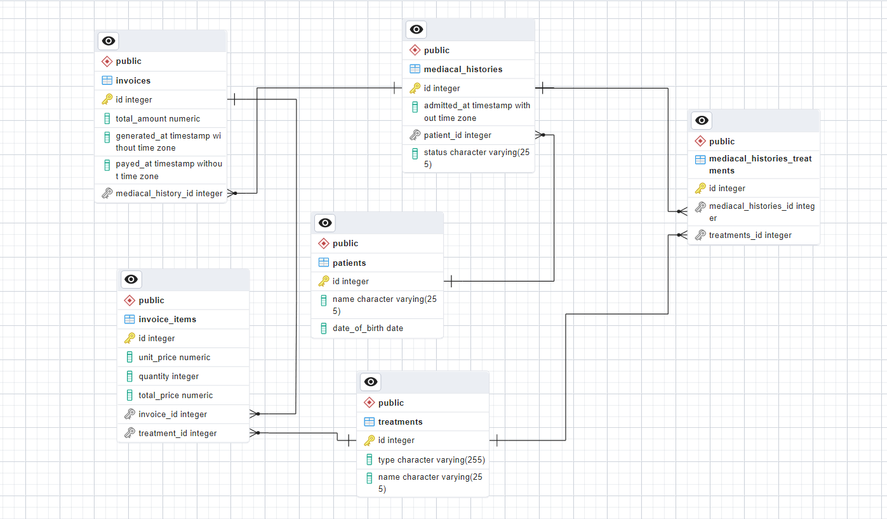

# Vet Clinic Postgresql 

# 📗 Table of Contents

- [📖 About the Project](#about-project)
  - [🛠 Built With](#built-with)
    - [Tech Stack](#tech-stack)
    - [Key Features](#key-features)
  - [🚀 Database Diagram](#database-diagram)
- [💻 Getting Started](#getting-started)
  - [Setup](#setup)
  - [Prerequisites](#prerequisites)
  - [Install](#install)
  - [Usage](#usage)
  - [Deployment]()
- [👥 Authors](#author)
- [🔭 Future Features](#future-features)
- [🤝 Contributing](#contributing)
- [⭐️ Show your support](#support)
- [🙏 Acknowledgements](#acknowledgements)
- [❓ FAQ](#faq)
- [📝 License](#license)

<!-- PROJECT DESCRIPTION -->

# 📖 Vet Clinic Postgresql  <a name="about-project"></a>

> A veterinary clinic database is a relational database designed to manage and store information related to the operation of a veterinary clinic. 
User can use the project query to create, read, update and delete specific data fromm the database using sql terminal, enabling efficient management and analysis of clinic data.

### Entity Relational Diagram

<div align="center">
  
  <br/>
</div>

## 🛠 Built With <a name="built-with"></a>

### Tech Stack <a name="tech-stack"></a>

<details>
  <summary>Client</summary>
  <ul>
    <li><a href="https://sql.sh/">SQL</a></li>
  </ul>
</details>

<details>
  <summary>Server</summary>
  <ul>
    <li>Local port server</li>
  </ul>
</details>

<details>
<summary>Database</summary>
  <ul>
    <li><a href="https://www.postgresql.org/">PostgresQL</a></li>
  </ul>
</details>

<!-- Features -->

### Key Features <a name="key-features"></a>

- **The user can create, inset and query the  database table using this project.**
- **Efficient Data Management**

<p align="right">(<a href="#readme-top">back to top</a>)</p>

<!-- LIVE DEMO -->

## 🚀 Live Demo <a name="live-demo"></a>
Not available

<p align="right">(<a href="#readme-top">back to top</a>)</p>

<!-- GETTING STARTED -->

## 💻 Getting Started <a name="getting-started"></a>

### Prerequisites

In order to run this project you need:
- Installed Git.
- Installed [PostgreSQL](https://www.tutorialspoint.com/postgresql/postgresql_environment.htm)
- Create a local directory that you want to clone the repository.
- Open the command prompt in the created directory.
- On the terminal run this command git clone https://github.com/Eric2umeh/vet_clinic_postgresql.git

### Setup

Clone this repository to your desired folder:

```sh 
git clone https://github.com/Eric2umeh/vet_clinic_postgresql.git
  ```
  ```sh 
  cd vet_clinic_postgresql
  ```

### Usage
- Create a new database then open a sql editor or sql ternimal then your can use below SQL language to read and update your database with multiple tables.
- Use [schema.sql](./schema.sql) to create all tables.
- Use [data.sql](./data.sql) to populate tables with sample data.
- Check [queries.sql](./queries.sql) for examples of queries that can be run on a newly created database.

<p align="right">(<a href="#readme-top">back to top</a>)</p>

<!-- AUTHORS -->

## 👥 Author <a name="authors"></a>

### 👤 **Eric Umeohabike**:
- GitHub: [@Eric2umeh](https://github.com/Eric2umeh)
- Twitter: [@King_Eric_](https://twitter.com/King_Eric_)
- LinkedIn: [@Eric Umeohabike](https://www.linkedin.com/in/eric-umeohabike)

## 🔭 Future Features <a name="future-features"></a>
- [ ] **Add more query to manage the database.**
- [ ] **Integrate back-end.**
<p align="right">(<a href="#readme-top">back to top</a>)</p>

## 🤝 Contributing <a name="contributing"></a>
Contributions, issues, and feature requests are welcome!
Feel free to check the [issues page](https://github.com/eric2umeh/country-metrics/issues).

<p align="right">(<a href="#readme-top">back to top</a>)</p>

<!-- SUPPORT -->

## ⭐️ Show your support <a name="support"></a>
If you liked this project, give it a ⭐️.

<p align="right">(<a href="#readme-top">back to top</a>)</p>

<!-- ACKNOWLEDGEMENTS -->

## 🙏 Acknowledgments <a name="acknowledgements"></a>

I would like to thank [Postgresql](https://www.tutorialspoint.com/postgresql/index.htm) & Microverse team for this journey.

<p align="right">(<a href="#readme-top">back to top</a>)</p>


<!-- LICENSE -->

## 📝 License <a name="license"></a>

This project is [MIT](./LICENSE) licensed.

<p align="right">(<a href="#readme-top">back to top</a>)</p>
